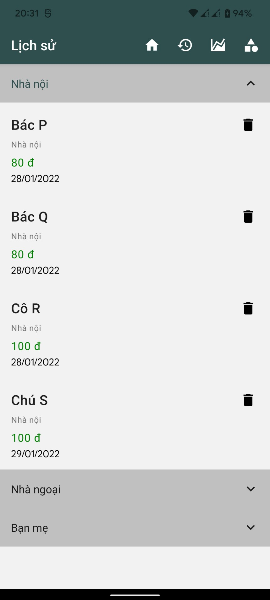
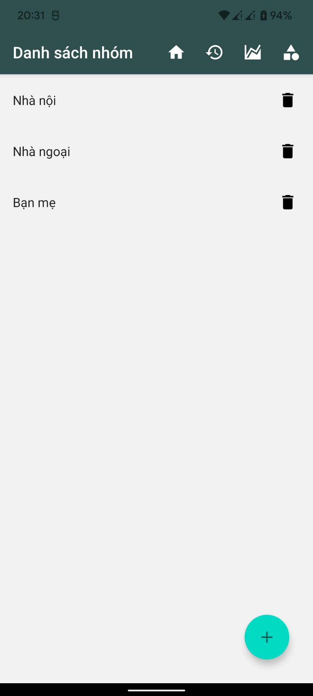
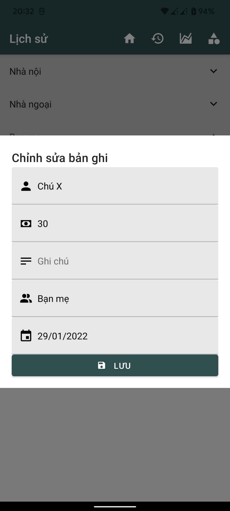
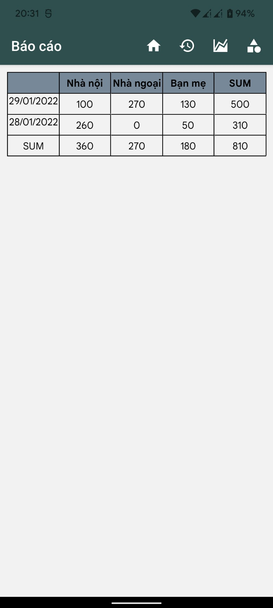
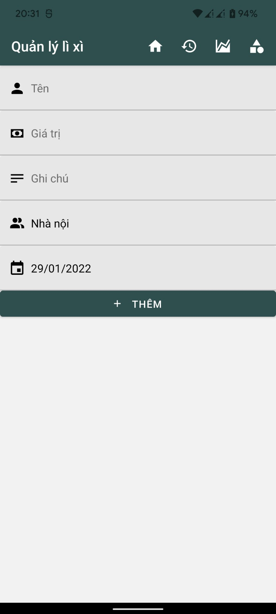

# Ứng dụng... quản lý tiền lì xì

Mục tiêu chính là để nghịch React Native 🐧

## Các dependency chính: 
- `react-native-paper`
- `react-navigation`
- `react-redux`
- `react-native-toast-message`
- `strftime`
- `react-native-table-component`

## Hình ảnh demo

  

(\*) Dữ liệu giả